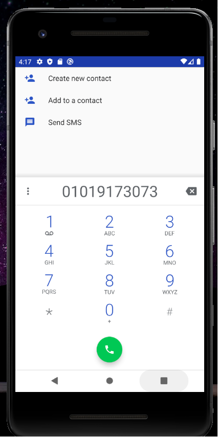

# 19173073 강세림

## 1주차 과제

## 2주차 과제
  
</img> 

## 3주차 과제

</img>

</img>

## 4주차 과제

### ◎ 영·한 사전이면서 동시에 단어장을 생성하고 단어 테스트를 할 수 있는 앱

</img>

영어 공부를 하는 사람들은 영·한 사전을 많이 사용합니다.
하지만 공부를 하다가 모르는 단어가 있을 때 한국어로 찾기만 하고 끝내면 영어 실력을 향상시키기 힘들 것입니다. 
그렇다고 찾은 단어를 하나하나 다 손으로 쓰는 것은 시간도 많이 걸리고 힘이 듭니다.
그래서 모르는 단어를 찾을 수 있는 것은 물론, 찾은 단어를 자동으로 단어장에 담아줘 편리하게 단어를 공부할 수 있게 하며, 
공부를 한 후 실력을 확인을 할 수 있게 단어장에 담긴 단어들로 단어 테스트를 만들어줘 공부가 끝난 저녁이나, 
정해진 시간에 알람을 울려 단어 테스트를 할 수 있게 해주는 겁니다.
그러면 영어공부하는 사람들이 편리하게 공부할 수 있으며 영어 실력도 빠르게 향상될 것입니다.

## 7주차 과제

</img> </img></img>
